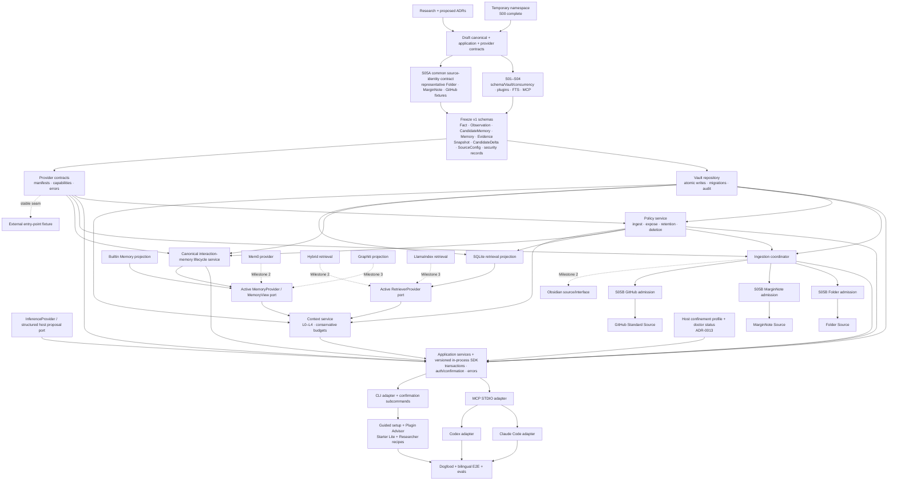

# MVP Dependency Graph

This graph turns PRD §48 into implementation order. Arrows mean “must be stable enough before.”
Dashed nodes are seams or later milestones, not MVP implementation work.

## Critical path

1. Use the S00 temporary namespace; confirm public name/license before release.
2. Complete S01–S04 and common source-contract S05A; accept/revise ADRs.
3. Freeze canonical schema v1 (including interaction memory) and provider/application contracts v1.
4. Implement Vault + policy before any source, memory, or retrieval provider.
5. Implement application services, canonical memory lifecycle, ingestion, and builtin projections.
6. Expose bounded context through CLI/MCP, then host adapters.
7. Dogfood real sources; pass portability, privacy, temporal, and bilingual evaluation gates.

## Classification

| Class | Included work |
|---|---|
| Must-have MVP | schemas, Vault, policy, application SDK, canonical memory lifecycle, three source providers, builtin memory, SQLite retrieval, context service, CLI/MCP, guided setup/Plugin Advisor, two host adapters, bilingual docs/tests |
| Dogfooding feature | maintainer source fixtures, Starter Lite/Researcher recipes, L0 card, sync/review/status UX |
| Architecture seam | provider protocols, manifests, entry-point fixture, transport boundary, projection ledger |
| Future extension | Mem0, Graphiti, LlamaIndex, hybrid retrieval, Obsidian, HTTP service, registry |
| Nice-to-have | visual catalog, rich dashboard, native tokenizer extension, broad auto-discovery |

## Rules that prevent false parallelism

- Source adapters may proceed in parallel only after Snapshot/CandidateDelta contracts stabilize.
- CLI and MCP may proceed in parallel only after application-service APIs and error semantics stabilize.
- Host adapters may proceed in parallel after MCP schemas are snapshot-tested.
- Optional backend implementation cannot begin merely because its interface exists; its milestone and
  spikes must be approved.
